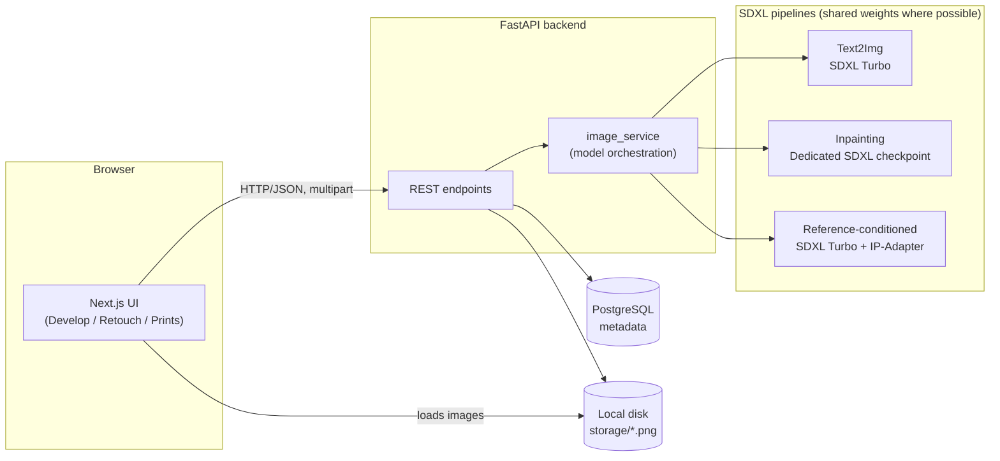

# PicDrop

A fully local, privacy-first AI image generation and editing platform —
inspired by Google's Nano Banana / Gemini image models, built from scratch
on open-source Stable Diffusion XL models running entirely on-device on
Apple Silicon. No API keys, no cloud inference, no per-image cost.

> Everything runs locally: the model weights, the compute, and the
> generated images never leave your machine.

<!--
  Add a screenshot before pushing, then uncomment:
  <p align="center">
    
  </p>
  See docs/screenshots/README.md for what to capture.
-->

## Features

- **Text-to-image generation ("Develop")** — SDXL Turbo, tuned for fast local inference (~10-25s/image on Apple Silicon)
- **Masked inpainting ("Retouch")** — paint exactly the region to change; a dedicated quality SDXL inpainting checkpoint (real diffusion steps + classifier-free guidance) regenerates only that area, keeping everything else pixel-close to the original
- **Invert Mask** — paint around a subject, invert, and edit the background instead — without hand-painting a large region
- **Reference-image conditioning** — IP-Adapter support lets a second image steer style or character likeness alongside your text prompt
- **Conversational editing** — continue editing your last result directly, chaining edits instead of starting over each time
- **Undo** — step back through your edit session at any point
- **Persistent history ("Prints")** — every generation is saved (Postgres for metadata, local disk for images) and browsable, with per-item or bulk delete
- **Upscale & download** — quick 2x upscale and one-click download on any result

## Design

A bold, single-page interface: a near-black canvas with soft gradient glow,
an oversized headline, and one large pill-shaped console that holds the
active tool — the prompt box for Develop, the mask-painting canvas for
Retouch. Mode switching happens through three pill buttons in the top bar
rather than a conventional tab bar or sidebar.

| | |
|---|---|
| Display type | Manrope (bold/extrabold) |
| UI/metadata type | IBM Plex Mono |
| Accent | Violet → cyan gradient glow on black |

## Tech stack

| Layer | Technology |
|---|---|
| Frontend | Next.js, TypeScript, Tailwind CSS |
| Backend | FastAPI (Python), async |
| Image generation | SDXL Turbo (`stabilityai/sdxl-turbo`) via 🤗 Diffusers |
| Inpainting | Dedicated SDXL inpainting checkpoint (`diffusers/stable-diffusion-xl-1.0-inpainting-0.1`) |
| Reference conditioning | IP-Adapter (`h94/IP-Adapter`) |
| Inference backend | PyTorch + Apple Metal (MPS) |
| Database | PostgreSQL (via SQLAlchemy) |
| Image storage | Local filesystem |

## Architecture



Full breakdown of design decisions (why Turbo vs. a dedicated inpainting
model, why files aren't stored in Postgres, why there's no auth/Redis
layer) lives in [`docs/ARCHITECTURE.md`](docs/ARCHITECTURE.md).

## Quick start

```bash
# Backend
cd backend
python3 -m venv .venv && source .venv/bin/activate
pip install -r requirements.txt
brew install postgresql@16 && brew services start postgresql@16
createdb Text_to_Image
cp .env.example .env
python -m uvicorn app.main:app --reload --port 8000

# Frontend (separate terminal)
npx create-next-app@latest frontend-app --typescript --tailwind --app --no-src-dir
# then replace frontend-app/app/page.tsx with frontend/page.tsx from this repo
cd frontend-app && npm run dev
```

Open `http://localhost:3000`. First generation will be slow — it's
downloading model weights (several GB across the three pipelines,
downloaded lazily as each feature is first used).

**Full step-by-step setup, environment gotchas, and troubleshooting:**
see [`docs/SETUP.md`](docs/SETUP.md).

## Project structure

```
picdrop/
├── backend/
│   ├── app/
│   │   ├── main.py              # FastAPI routes
│   │   ├── database.py          # SQLAlchemy engine/session
│   │   ├── models.py            # Generation table
│   │   ├── schemas.py           # Pydantic response models
│   │   └── services/
│   │       └── image_service.py # Model loading + inference
│   ├── storage/                 # Generated images (gitignored)
│   └── requirements.txt
├── frontend/
│   └── page.tsx                 # Single-page app (Next.js)
└── docs/
    ├── ARCHITECTURE.md
    ├── SETUP.md
    └── screenshots/
```

## Known limitations

- **Local-only, single-user** — no auth layer; not designed for multiple
  concurrent users out of the box
- **Upscale is Lanczos resize, not AI super-resolution** — fast, but
  doesn't invent new detail the way a model like Real-ESRGAN would
- **Apple Silicon (MPS) focused** — works on CUDA/CPU too, but tuning
  (memory optimizations, step counts) was done against a 16GB M-series Mac
- **Generation speed varies a lot by pipeline** — Turbo results in
  seconds; the dedicated inpainting model takes 1-2 minutes for
  meaningfully higher quality

## Possible next steps

- Real AI upscaling (Real-ESRGAN)
- ControlNet for pose/composition-guided generation
- LoRA support for consistent custom styles/characters
- Packaging as a one-command local install

## License

MIT — see [`LICENSE`](LICENSE).

Step into your own private darkroom and turn any idea into a picture — no cloud, no limits, just you and your imagination!
_Prompt it. Paint it. Keep it all on your machine._ 🎞️✨

![yoo buddy]https://media.tenor.com/sjV9-bvcOaoAAAAM/yes-hell-yes.gif